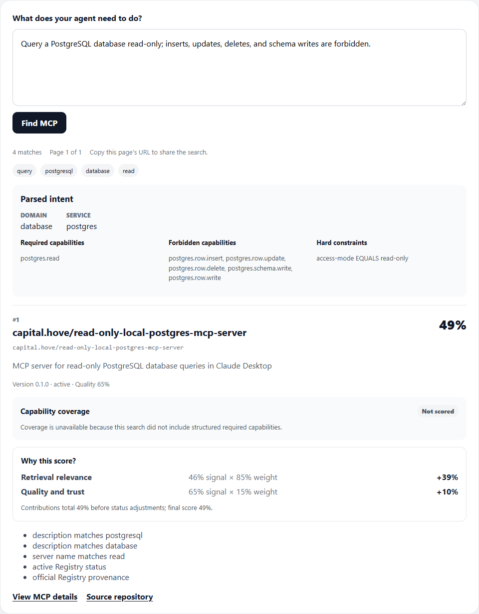
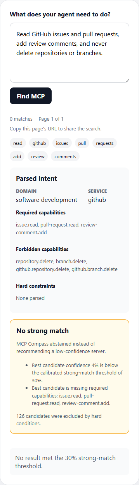
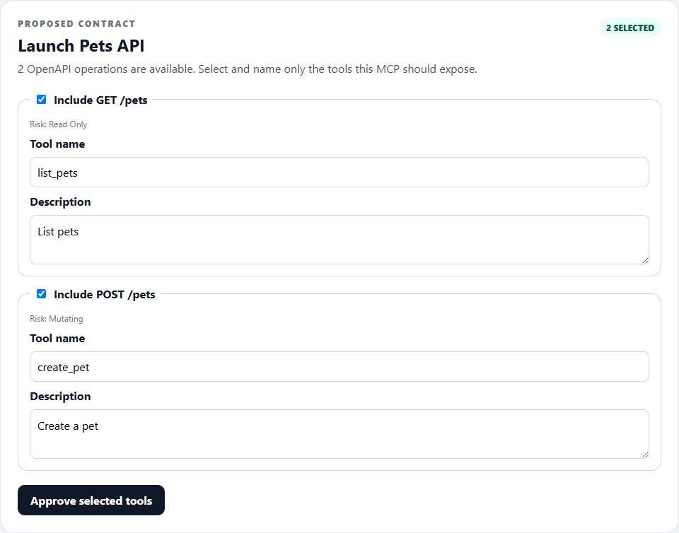

# MCP Compass

**Find the right MCP server from what your agent needs—not from a directory scroll.**

[](https://github.com/jinjin-huang-3366/mcp-compass/actions/workflows/ci.yml)

MCP Compass turns a natural-language agent capability requirement into ranked existing MCP server matches. It shows
the parsed intent, required and forbidden capabilities, and the evidence behind each score. When the evidence is too
weak, it abstains. Only when reuse is inadequate does the separate generation path begin—with a reviewed tool
contract before any source code is produced.

[Open the deployed UI](https://mcp-compass-iota.vercel.app/) ·
[Read the API](docs/API.md) ·
[Contribute](CONTRIBUTING.md)

> **Verified public demo:** the canonical URL above loaded successfully and completed an `mt5` search against the
> production API on 2026-09-12.

## See the workflow

### Requirement → ranked, explained match



Search is performed against locally persisted MCP Registry data—not by proxying every user query to the public
Registry. Deterministic ranking keeps capability coverage dominant and exposes retrieval, quality, and trust signals.

### Weak or unsafe evidence → abstain



Hard prohibitions are applied before ranking. A low-confidence or policy-conflicting candidate does not become a
recommendation just because it shares keywords.

### Reuse inadequate → review a contract before generation



An OpenAPI source first becomes an editable MCP tool contract. After approval, MCP Compass can export a GitHub-ready
TypeScript project with locked dependencies and CI. See the [capture provenance and accessibility notes](docs/assets/launch/README.md).

No GIF is included: the three states are understandable as still images, which are smaller, easier to inspect, and do
not make motion the only source of information.

## What is ready

- Requirement analysis with explicit required capabilities, forbidden capabilities, and hard constraints.
- Local Registry ingestion, enriched search documents, lexical/optional vector retrieval, deterministic ranking, and
  score explanations.
- Strong-match confidence and an explicit no-match abstention path.
- MCP detail pages, shareable search URLs, CLI search/generation commands, and IDE launch integration.
- Contract-first OpenAPI ingestion, review, TypeScript generation, and GitHub-ready ZIP export.
- Queued validation with a separate container worker, MCP Inspector protocol checks, and conservative tool-risk reports.

The fixed 53-judgement demo-quality gate recorded 96.2% Recall@100, 0.8620 NDCG@10, 24/24 top-three acceptance,
zero forbidden-result violations in the top three, and 8/8 correct abstentions. These are point-in-time evaluation
results, not a claim about every MCP server. Read the [quality report](docs/reports/DEMO_QUALITY_GATE_V1.md).

## Quick start

Prerequisites: Java 21, Node.js 22+, Docker, and Git.

```bash
git clone https://github.com/jinjin-huang-3366/mcp-compass.git
cd mcp-compass
docker compose up -d db
./mvnw -pl backend spring-boot:run
```

In a second terminal:

```bash
cd web
cp .env.local.example .env.local
npm install
npm run dev
```

Open <http://localhost:3000>. To seed a local Registry page, confirm the backend started with the `local` profile,
then run:

```bash
curl -X POST "http://localhost:8080/api/v1/dev/registry/sync?maxPages=1"
```

Windows PowerShell equivalents and configuration details are in the [development guide](docs/DEVELOPMENT.md).

### CLI

With the backend running:

```bash
cd cli
npm install
npm run build
node dist/src/index.js find "Query PostgreSQL read-only; forbid inserts, updates, deletes, and schema writes"
```

See [CLI search](docs/CLI_FIND.md) and [CLI generation](docs/CLI_GENERATE.md) for complete usage.

## Architecture

MCP Compass is a modular monolith: a Next.js/TypeScript frontend, a Java 21/Spring Boot backend, and PostgreSQL with
pgvector. External systems sit behind clients, and the user search path reads the local database. Generated or
third-party MCP code never executes in the backend JVM; validation belongs to a separate, ephemeral container worker.

```text
requirement → capability extraction → local candidate retrieval → deterministic ranking → explanation
                                                                           ↓ no adequate reuse
OpenAPI source → proposed tool contract → developer review → TypeScript project → isolated validation
```

Start with [architecture](docs/ARCHITECTURE.md), [security reporting](SECURITY.md), and the
[security model](docs/SECURITY.md), plus the
[deployment runbook](docs/DEPLOYMENT.md).

## Current limitations

- Registry coverage is a synchronized snapshot and is not the entire MCP ecosystem.
- Optional LLM analysis, embeddings, and GitHub enrichment require configured providers; lexical search remains the
  tested fallback.
- Production validation jobs remain queued unless the separately hosted validation worker is running. Validation is
  bounded evidence, not a security certification.
- Generated projects target the repository-owned TypeScript runtime pack; other language targets are not implemented.

## Contributing

Read [CONTRIBUTING.md](CONTRIBUTING.md) before opening a pull request. Use the public
[bug report](https://github.com/jinjin-huang-3366/mcp-compass/issues/new?template=bug_report.yml) or
[feature request](https://github.com/jinjin-huang-3366/mcp-compass/issues/new?template=feature_request.yml) forms.
Do not publish vulnerabilities in an issue; use GitHub's
[private security advisory flow](https://github.com/jinjin-huang-3366/mcp-compass/security/advisories/new).

## Automated task pull requests

`$mcp-task-pr-flow` implements and publishes exactly one planned task. The local Codex session branches from `main`,
synchronizes and validates the implementation, pushes without force, then dispatches
`.github/workflows/task-pr.yml`. The workflow revalidates the branch, opens (but never merges) a pull request, starts
baseline CI, and emails the handoff using repository secrets. `$mcp-task-batch-flow PG-##` coordinates independent
group members while preserving one branch, workflow, plan marker, email, and pull request per task.

Maintainers must configure `GMAIL_ADDRESS` and `GMAIL_APP_PASSWORD`, allow GitHub Actions to create pull requests,
and review every generated PR manually. The workflow needs no OpenAI API key. Exact plan items remain unchecked on
task branches; `.github/workflows/plan-completion.yml` marks one complete only after its linked PR is manually merged.
See [PLANS.md](PLANS.md#parallel-delivery-groups) for the delivery groups and conflict-at-handoff guarantee.

## Project map

- `backend/` — search, ranking, generation, and validation APIs.
- `web/` — developer-oriented Next.js UI.
- `cli/` — `find`, `generate`, and IDE launch commands.
- `validation-worker/` — isolated container validation control plane.
- `docs/` — architecture, API, development, deployment, security, evaluation, and decision records.
- `.agents/skills/` — repository-scoped MCP Compass workflows for coding agents.

Release-facing changes are curated in [CHANGELOG.md](CHANGELOG.md); implementation sequencing lives in
[PLANS.md](PLANS.md).
